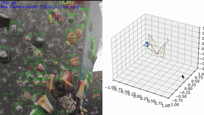
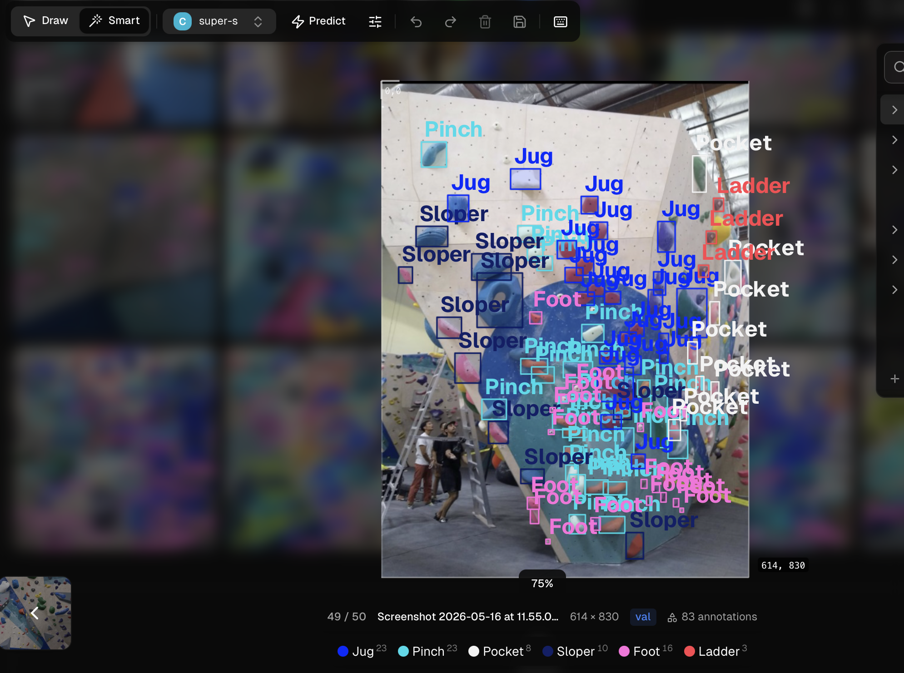

# Super Cool Journal 
A day by day log of new implementations, potential ideas, and challenges faced while working on climb-cv!

First prototype:

Latest prototype (06/13/26):

## June 13, 2026 - Aaron

* **Predictive climbing holds detection** (see latest prototype)
* Added parallel processing to YOLO model, so it won't impede on main video stream
* Models accuracy can be improved, but it requires more training data
* Using Ultralytics dashboard in an attempt to streamline the training process and improve model performance
* its a LOT harder training data than expected